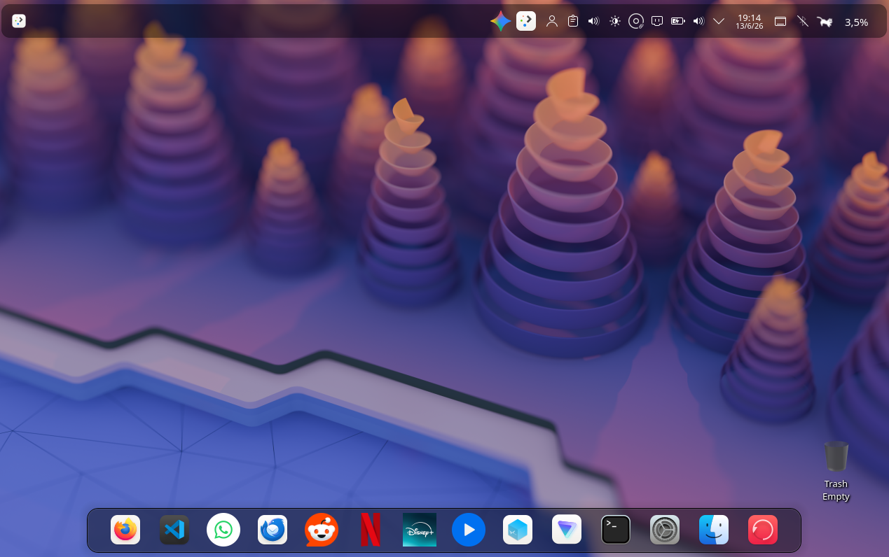

# vArch-OS


> A personal Arch Linux distribution — encrypted by default, KDE Plasma, minimal bloat.

---

## Interface



[git _video.webm](https://github.com/user-attachments/assets/1a83561e-82b3-4488-b605-fc1237595e3e)


---

## What is vArch-OS?

vArch-OS is a custom Arch Linux-based distribution built for personal use. It ships as a bootable ISO with a graphical live environment and an interactive installer that handles everything from disk partitioning to desktop theming in a single run.

**Key highlights:**

- Full-disk **LUKS encryption** on the root partition (optional, prompted during install)
- **KDE Plasma** desktop with a polished **WhiteSur-dark** (macOS-inspired) look and feel
- **Zsh + Oh My Zsh** with autosuggestions, syntax highlighting, and the `bira` theme
- **PipeWire** audio stack (ALSA + PulseAudio + WirePlumber)
- Intel GPU drivers out of the box (`mesa`, `vulkan-intel`, `intel-media-driver`)
- Multilib enabled for 32-bit compatibility (Steam, Wine, etc.)
- **Timeshift** for system snapshots, **Proton VPN** for privacy
- Custom `os-release` (`NAME="vArch-OS"`) — it shows up as its own distro
- Firefox as default browser (Falkon removed), Thunderbird, VS Code, VirtualBox included

---

## Security

### LUKS Full-Disk Encryption

The root partition (`/dev/sdX2`) is encrypted with **LUKS** using `cryptsetup`. During boot, GRUB prompts for the passphrase before handing off to the kernel. The kernel parameter looks like:

```
cryptdevice=UUID=<partition-uuid>:cryptroot root=/dev/mapper/cryptroot
```

The `encrypt` hook must be present in `/etc/mkinitcpio.conf` — the installer handles this automatically when encryption is chosen.

Default credentials (change immediately after install):

| | Default |
|---|---|
| LUKS passphrase | `vArch` |
| Username | `vArch` |
| User password | `vArch` |
| Hostname | `vArch` |

→ See [step-by-step.md — Encrypt the partition](step-by-step.md#encrypt-the-partition)

### Other security defaults

- Root account is **locked** after install (`passwd -l root`)
- The `wheel` group has full `sudo` access
- KDE Wallet (`kwalletrc`) is configured and available for credential storage
- Baloo file indexer is configured (can be disabled for privacy)

---

## Installation

### Option 1 — ISO (Recommended)

Boot the [ISO](./ISO_Receipt/vArch-OS-2026.08.22-x86_64.iso), double-click the **Welcome Installer** icon on the desktop. The installer runs inside Konsole and guides you through:

1. Username and password setup
2. Internet connection (wired auto-detected, Wi-Fi via `nmcli`)
3. Timezone selection
4. Disk selection and optional LUKS encryption
5. Full base + desktop install
6. Dotfiles and theme application
7. Service enablement and reboot

The installer script: [src/Welcome_Installer.sh](src/Welcome_Installer.sh)
The desktop launcher: [Welcome_Installer.desktop](Welcome_Installer.desktop)

### Option 2 — Manual

Follow the step-by-step guide to build the system by hand:

→ [step-by-step.md](step-by-step.md)

Post-install desktop setup:

→ [desktop-customization.md](desktop-customization.md)

---

## Building the ISO

The ISO is built with **archiso** using the `releng` profile as a base. The live environment auto-logs in as root into a KDE Plasma session with the installer on the desktop.

Build guide: [iso-step-by-step.md](iso-step-by-step.md)

Key build details:

- Compression: `zstd -Xcompression-level 15` (faster than xz, good ratio)
- Output: ~4 GB ISO, needs ~40 GB workspace
- Services enabled in the live ISO: `NetworkManager`, `systemd-timesyncd`, `plasmalogin`
- Autologin: root → `plasma.desktop` session

Additional package list: [src/packages.sh](src/packages.sh)

---

## Theming

| Setting | Value |
|---|---|
| Look and Feel | WhiteSur-dark (`com.github.vinceliuice.WhiteSur-dark`) |
| Icons | WhiteSur-dark |
| Cursors | WhiteSur-cursors |
| GTK theme | Breeze-Dark |
| Font | Noto Sans 10 |
| Shell | Zsh + Oh My Zsh (`bira` theme) |
| Accent color | `#315bef` |

KDE config files: [Files needed/.config/](Files%20needed/.config/)
Shell config: [Files needed/.zshrc](Files%20needed/.zshrc)

---

## Partition Layout

```
/dev/sdX
├── /dev/sdX1   1 GB    EFI System Partition   FAT32    /boot
└── /dev/sdX2   rest    Root                   ext4     /  (LUKS optional)
```

NVMe and MMC devices (`/dev/nvme0n1`, `/dev/mmcblk0`) are handled automatically by the installer (`p1`/`p2` suffix).

---

## Versioning

New releases ship on separate branches. Each branch corresponds to a specific ISO build — check the branch list for available versions. The `main` branch tracks the current stable release; `dev` is the working branch.

---

## Recomendations

It is recomended to do an update when installing!

---

## Checksum

*(Will be added with each ISO release)*

08/22/2026 Version: v0id0100

Checksum256: 

Test it:

```bash
sha256sum vArch-OS-2026.08.22-x86_64.iso
```

## Donations

I do this project for the community but I accept donations from BTC:

bc1q4y0zjs4thu5hhpgzk9wzdpudczn3wnsartmzwn
