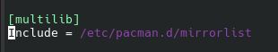
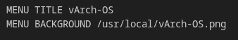
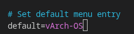
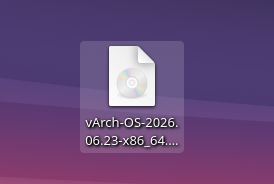

# ISO Step By Step

Here I will explain the step by step making the ISO file.

The entire ISO configuration is: [ISO Receipt](./ISO_Receipt/vArch-OS)

If you just want to copy and compile go to: [ISO Compiling](#iso-compiling)

### Downloading archiso

```bash
sudo pacman -S archiso --noconfirm
```

### Environment

Create your environment folder:
```bash
mkdir ~/vArch-OS
cd ~/vArch-OS
cp -r /usr/share/archiso/configs/releng/* .
```

### Prepare your apps:
```bash
pacman -Qq > ../vArch-OS.txt
```

Then copy all that to vArch-OS/packages.x86_64:
```bash
cat ../vArch-OS.txt >> packages.x86_64
echo "kde-applications" >> packages.x86_64
```

Then add additional packages:
```bash
#zsh
git clone https://github.com/ohmyzsh/ohmyzsh.git airootfs/root/.oh-my-zsh
mkdir -p airootfs/root/.oh-my-zsh/custom/plugins

git clone https://github.com/zsh-users/zsh-autosuggestions airootfs/root/.oh-my-zsh/custom/plugins/zsh-autosuggestions
git clone https://github.com/zsh-users/zsh-history-substring-search airootfs/root/.oh-my-zsh/custom/plugins/zsh-history-substring-search
git clone https://github.com/zsh-users/zsh-syntax-highlighting airootfs/root/.oh-my-zsh/custom/plugins/zsh-syntax-highlighting
```

<h3>You have delete grml-zsh-config and litehtml0.9 from the packages.x86_64, if not, it will give errors.</h3>

### Fix multilib:

Edit ~/vArch-OS/pacman.conf

And deselect those lines:



### Enable services in systemctl:

I will use relative path because when ISO is started on live it will search relative path not absolute.

To enable those services in the beginning I will use symbolic links:
```bash
# NetworkManager
mkdir -p ~/vArch-OS/airootfs/etc/systemd/system/multi-user.target.wants

ln -s /usr/lib/systemd/system/NetworkManager.service ~/vArch-OS/airootfs/etc/systemd/system/multi-user.target.wants/NetworkManager.service

# Timesync
ln -s /usr/lib/systemd/system/systemd-timesyncd.service ~/vArch-OS/airootfs/etc/systemd/system/multi-user.target.wants/systemd-timesyncd.service

# Plasmalogin (equivalent to: systemctl enable plasmalogin)
ln -s /usr/lib/systemd/system/plasmalogin.service ~/vArch-OS/airootfs/etc/systemd/system/display-manager.service
```

### Desktop customization:

I will add my apps, app panel, order, themes etc. to my distro too:

```bash
cd /tmp
git clone https://github.com/v0id0100/vArch-OS.git
cd vArch-OS/Files\ needed

rm -rf ~/vArch-OS/airootfs/root/.{config,icons,local,oh-my-zsh,gtkrc-2.0}

cp -r . ~/vArch-OS/airootfs/root/

cp -r .{config,icons,local,gtkrc-2.0,oh-my-zsh} ~/vArch-OS/airootfs/root/
```

### Autologin at the beginning:

To autologin with Graphical Interface kde creates a usar called: *archiso*.

Config enabling it to autologin:

```bash
cd ~/vArch-OS
mkdir -p airootfs/etc/plasmalogin.conf.d/
```

```bash
cat > ~/vArch-OS/airootfs/etc/plasmalogin.conf.d/autologin.conf << 'EOF'
[Autologin]
User=root
Session=plasma.desktop
EOF

chmod 644 ~/vArch-OS/airootfs/etc/plasmalogin.conf.d/autologin.conf
```

### Custom ISO:

Update ISO settings in ./profiledef.sh:


Update the hostname: ~/vArch-OS/airootfs/etc/hostname

```bash
echo vArch > ~/vArch-OS/airootfs/etc/hostname
```

Make sure `packages.x86_64` includes `plasma-login-manager` and `plasma-meta` so the live image can start Plasma.

Update the Welcome screen: ~/vArch-OS/syslinux/archiso_head.cfg



Update the GRUB menu: ~/vArch-OS/grub/grub.cfg



### Custom OS:

To change the distro name and version you have to change ~/vArch-OS/airootfs/etc/os-release:

```text
NAME="vArch-OS"
PRETTY_NAME="vArch-OS"
ID=vArch-OS
BUILD_ID=v0id0100
ANSI_COLOR="38;2;23;147;209"
HOME_URL="https://github.com/v0id0100/vArch-OS"
DOCUMENTATION_URL=""https://github.com/v0id0100/vArch-OS
SUPPORT_URL="https://github.com/v0id0100/vArch-OS/issues"
BUG_REPORT_URL="https://github.com/v0id0100/vArch-OS/issues"
PRIVACY_POLICY_URL="https://terms.archlinux.org/docs/privacy-policy/"
LOGO=/usr/local/vArch-OS.png
```

To change the entrance Welcome:
```bash
vim efiboot/loader/entries/0*-archiso-linux.conf
```

And update the title

### Doing the installer:

For the graphic interface I have to download the files from somewhere:
- .config
- .local
- .zshrc
- .icons
- .gtkrc-2.0
- .oh-my-zsh

I will set it here: [Files Needed](./Files%20needed/)

The script that will run the installer is: [Welcome_Installer.sh](./src/Welcome_Installer.sh)

### Setting the Welcome_installer in the ISO:

Then script will be in desktop like and app:

```bash
cd /tmp/vArch-OS
mkdir -p ~/vArch-OS/airootfs/root/Desktop && cp Welcome_Installer.desktop ~/vArch-OS/airootfs/root/Desktop 
```

File: [Welcome_Installer.desktop](Welcome_Installer.desktop)

```bash
cd src
cp Welcome_Installer.sh ~/vArch-OS/airootfs/usr/local/bin
```

The icon must be in: airootfs/usr/local/vArch-OS.png 

```bash
cd ..
cp vArch-OS.png ~/vArch-OS/airootfs/usr/local/    
```

The script must be in: airootfs/usr/local/bin/Welcome_Installer.sh 

### Permissions:

File: ~/vArch-OS/profiledef.sh

Here you have to set all the folders and files you set:
```text
["/usr/local/bin/Welcome_Installer.sh"]="0:0:0755"
["/usr/local/vArch-OS.png"]="0:0:0644"
["/etc/systemd/system/display-manager.service"]="0:0:0755"
["/etc/plasmalogin.conf.d/autologin.conf"]="0:0:0644"
["/etc/os-release"]="0:0:0644"
["/root"]="0:0:0755"
["/root/.config"]="0:0:0755"
["/root/.icons"]="0:0:0755"
["/root/.local"]="0:0:0755"
["/root/.gtkrc-2.0"]="0:0:0755"
["/root/.zshrc"]="0:0:0755"
["/root/.oh-my-zsh"]="0:0:0755"
["/root/Desktop"]="0:0:0755"
["/root/Desktop/Welcome_Installer.desktop"]="0:0:0755"
```

### Compressing:

In ~/vArch-OS/profiledef.sh change 

```text
airootfs_image_tool_options=('-comp' 'xz' '-Xbcj' 'x86' '-b' '1M' '-Xdict-size' '1M')
```

To:

```text
airootfs_image_tool_options=('-comp' 'zstd' '-Xcompression-level' '15' '-b' '1M')
```

That is for optimizing memory.

# ISO Compiling:

ALERT: **You will need space in your HD, I'll use 40GB for workspace, the ISO will be ~4GB**

Creating folder for workspace:
```bash
cd
mkdir -p ~/archiso-workspace && mkdir -p ~/archiso-out
```

Now compile:
```bash
cd ~/vArch-OS && sudo mkarchiso -v -w ~/archiso-workspace -o ~/archiso-out .
```

It will start compiling!!!

### ISO:

