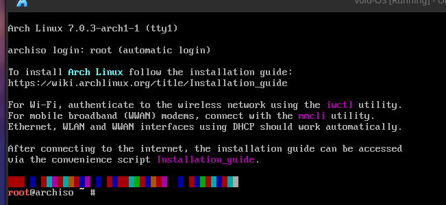
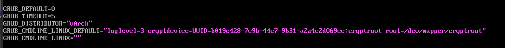

# Step by Step:

Before this, the requirements that it had been used for this installation are:
- x64 bit
- 4CPU's
- 4GB RAM
- 80GB Storage

---

### Downloading ISO:
    - In this case I downloaded the Spanish version: [Link](https://mirror.es.cdn-perfprod.com/archlinux/iso/2026.05.01/archlinux-2026.05.01-x86_64.iso)
    - If you want to check its hash: [b2sums.txt](https://archlinux.org/iso/2026.05.01/b2sums.txt)
```bash
# Go to downloads and check the hash:
b2sum -c b2sums.txt 
```
-
    -  Expected output:
```txt
archlinux-2026.05.01-x86_64.iso: OK
```

- Put the ISO in your pen drive and make it booteable. You can see a few tutorials in the Internet.

- Initiate it from the BIOS.

- Once in the GRUB select the first option.

---

### Once booted, it will display the welcome screen giving you the link of [Arch Linux Wiki](https://wiki.archlinux.org/title/Installation_guide). All the procediment will be from there:



- Now you configure your keyboard: 
```bash
# List Keys:
localectl list-keymaps

# Select keymap. Ex:
loadkeys es
```

---

### Configure Internet:

- Now if you don't have Internet, plug in the Ethernet cable (jump to setup [System Clock](#system-clock)), or configure Wi-Fi:

    - Know you network device name:
```bash
ip link

# Look at the output: ex: enp0s3
```

-   - Unblock the network devices:
```bash
# List them:
rfkill

# Unblock them: Ex:
rfkill unblock wlan
```

-   - Connect using iwctl tool:
```bash
iwctl

# List devices:
[iwd]: device list
[iwd]: device name set-property Powered on
[iwd]: adapter adapter set-property Powered on

# Scan the networks. It won't display any available networks yet:
[iwd]: station name scan

# Now display the scanned networks:
[iwd]: station name get-networks

# Connect with its name (SSID):
[iwd]: station name connect SSID

# Put the password
```

-   - Check your ip:
```bash
ip a

# Check Internet connection:
ping google.com
```

---

### System Clock
- Using **timedatectl**
```bash
# Ex: Madrid / Europe:
timedatectl set-timezone Europe/Madrid
```

---

### Partitioning:

- Now the important and the risky part: **Partitioning disk**:
    - We will do /boot/ partition and assign it 1GB, then the rest of the space in /.
    - The / will be encrypted with LUKS to be more secure.
    - List the current partitions:
```bash
# See the endpoints
fdisk -l # Results ex: /dev/sdx

# Do the partitions:
fdisk /dev/sdx # Your partition name

# Create new partition table:

Command (m for help): g

# Create new partition:
Command (m for help): n

# Create the table /boot:
Parition number (1-128, default 1): 1
First sector (2048-rest, default 2048): 2048
Last sector, +/-sectors or +/-size{K,M,G,T,P} (2048-rest, default rest): +1G # Set 1GB on /boot
```

-   - Same with /: Press enter repetitively

    - Partitions types: Set partition 1 (/boot) to an EFI partition:
```bash
Command (m for help): t

Parition number (1,2, default 2): 1
Partition type or alias (type L to list all): EFI System

# Check the partitions:
Command (m for help): p

# Write the results:
Command (m for help): w
```

- If you want /swap you could configure it but then the quantity would be fixed, instead, you may want to make it with a config file: [Link](https://wiki.archlinux.org/title/Swap)

---

### Encrypt the partition:

- We will encrypt the / to be more secure:
```bash
cryptsetup luksFormat /dev/sdx2 # Important to be NUMBER 2
```

<h2>I will set "vArch" as password, then you could change it with: </h2>

```bash
sudo cryptsetup luksChangeKey /dev/sdX2 # Important number 2
```

---

### Formatting partitions:

**!!! Be careful, at this step, the changes will be permanent !!!**

- Open the encrypted partition:
```bash
cryptsetup open /dev/sdx2 cryptroot
```

- The decrypted partition will be in: /dev/mapper/cryptroot

- Format /boot in FAT32 file system:

```bash
# List the partitions:
fdisk -l

# Format /boot
mkfs.vfat -F 32 /dev/sdx1

# Same with /
mkfs.ext4 /dev/mapper/cryptroot
```

---

### Mount the file system:

```bash
# Mount / to /mnt:
mount /dev/mapper/cryptroot /mnt

# Create the /boot in /mnt
mkdir -p /mnt/boot

# Mount /boot
mount /dev/sdx1 /mnt/boot
```

- !!! Check the order because it's important !!!

---

### Installation:

- Install some packages:
```bash
# !!! IMPORTANT !!!
# If you have Intel then install intel-ucode 
# If you have AMD then install: amd-ucode

pacstrap -K /mnt base linux linux-firmware intel-ucode nano vim man-pages man-db bluez-utils bluez networkmanager sof-firmware sudo grub efibootmgr git
```
- You are invited you install you own tools, this is only an initial ones.

---

### Configure the system:

- You have to create an fstab file to mount your drive in boot.

```bash
genfstab -U /mnt >> /mnt/etc/fstab
```

---

### Chroot:

- Now for participi you will chroot from your "temporal" drive /mnt:
```bash
arch-chroot /mnt
```
- !!! Congrats you are now in you terminal !!!

    - Now import your time:
```bash
ln -sf /usr/share/zoneinfo/Area/Location /etc/localtime #Ex Madrid: /usr/share/zoneinfo/Europe/Madrid 

# Then for hardware clock
hwclock --systohc

# Start:
systemctl enable systemd-timesyncd
```

-   - Language and keyboard on your device:
        - Edit */etc/locale.gen*:
        - Now remove the "#" in your desired keyboard and language. Is recomended to keep english because system default language: en_US.UTF-8 UTF-8
        - Now build the languages:
```bash
locale-gen
```
-   - Lock in your system language:
```bash
# Ex: spanish
echo "LANG=es_ES.UTF-8" > /etc/locale.conf
```

-   - Setup your keyboard:
```bash
# Ex: Spanish:
echo "KEYMAP=es" > /etc/vconsole.conf
```

--- 

### Encryption password prompt
- Now we have to tell our system to ask us for the password because if we don't configure that, grub will try to open a vault that is encrypted by LUKS.

- Edit /etc/mkinitcpio.conf and find the "HOOKS=(" line and copy that:
```txt
HOOKS=(base udev autodetect modconf kms keyboard keymap consolefont block encrypt filesystems fsck)
```

- Now that you have successfully copied, cook it:
```bash
mkinitcpio -p linux
```

---

### Set you own hostname:

- I will set vArch as default:
```bash
echo "vArch" > /etc/hostname && hostnamectl set-hostname vArch
```

- If you want to set your own hostname:
```bash
sudo hostnamectl set-hostname YOUR-HOSTNAME
```
- Open a new terminal

--- 

### Create your own user:

- This user will be with root permission.

```bash
useradd -m -G wheel vArch # Choose your own user
```

- The password will be vArch:
```bash
passwd vArch
```

- If you create a user and want to delete this:
```bash
sudo userdel vArch
```

---

### Wheel group has root permissions:

- Edit sudoers file with *visudo* and remove the "#" at the start of this sentence:
```txt
# %wheel ALL=(ALL:ALL) ALL
```

- Align it to the left, press 1 time "supr"

- Save and exit with ":wq"

---

### Lock the user root:

- You won't need the user root so remove the password:
```bash
passwd -l root
```

---

### Install the GRUB to your motherboard:

- GRUB is the entry to your system, so you have to configure it:
```bash
grub-install --target=x86_64-efi --efi-directory=/boot --bootloader-id=GRUB
```

---

### Configure GRUB:

- Now you have to configure GRUB to tell that it has to open the encrypted partition when you select "Arch Linux" in the Grub options.

- This step is very important. You have to set your own UUID disk in the config, to know your UUID, you must type:
```bash
blkid
```

- Exemple output:


- <h2>You have to set the UUID (NOT THE PARTUUID) of the TYPE "crypto_LUKS", VERY IMPORTANT</h2>

- Edit /etc/default/grub and set the following:

- Example finished:


- And finally generate your grub:
```bash
grub-mkconfig -o /boot/grub/grub.cfg
```

### The moment of the truth

- Exit the chroot by typing "exit".

- Umount the disk: 
```bash
umount -R /mnt
```

- Reboot:
```bash
reboot
```

- <h2>!!! REMOVE THE PENDRIVE !!!</h2>

### vArch:

- Continue on: [Desktop Customization](desktop-customization.md)